# Heart Disease Prediction System - Entity Relationship Diagram (ERD)

```mermaid
erDiagram
    %% User Management
    USERS {
        int id PK
        string username UK "unique"
        string email UK "unique"
        string password_hash "hashed"
        string role "admin/patient"
        string first_name
        string last_name
        string phone
        date date_of_birth
        string gender
        datetime created_at
        datetime last_login
        boolean is_active
        boolean email_verified
    }
    
    %% Prediction Management
    USER_PREDICTIONS {
        int id PK
        int user_id FK
        string session_id
        text input_data "JSON"
        text prediction "JSON"
        text individual_predictions "JSON"
        text explanation "JSON"
        datetime timestamp
        string source "manual_entry/pdf_upload/etc"
        string risk_level "Low/Medium/High"
        float probability
        text notes
        boolean is_shared "with doctor"
    }
    
    %% Medical Report Management
    USER_MEDICAL_REPORTS {
        int id PK
        int user_id FK
        string filename "stored filename"
        string original_filename
        string file_type "pdf/jpg/png"
        datetime upload_date
        text content "extracted text"
        text analysis_results "JSON"
        boolean is_processed
        int file_size "bytes"
    }
    
    %% Conversation History
    CONVERSATION_HISTORY {
        int id PK
        int user_id FK "nullable"
        string session_id
        text message
        boolean is_user "true=user, false=bot"
        datetime timestamp
        string state "conversation state"
    }
    
    %% Legacy Prediction Table (for backward compatibility)
    PREDICTIONS {
        int id PK
        string session_id UK "unique"
        text input_data "JSON"
        text prediction "JSON"
        text individual_predictions "JSON"
        text explanation "JSON"
        datetime timestamp
        string source
        string risk_level
        float probability
    }
    
    %% Model Training History
    MODEL_TRAINING_HISTORY {
        int id PK
        string model_type "knn/rf/xgboost"
        datetime training_date
        text parameters "JSON"
        text metrics "JSON"
        string model_file_path
        float accuracy
        float precision
        float recall
        float f1_score
        boolean is_active
    }
    
    %% Feature Importance History
    FEATURE_IMPORTANCE_HISTORY {
        int id PK
        int training_id FK
        string feature_name
        float importance_score
        float std_dev
        int rank
    }
    
    %% System Analytics
    SYSTEM_ANALYTICS {
        int id PK
        datetime date
        int total_users
        int active_users
        int total_predictions
        int predictions_today
        float avg_prediction_accuracy
        text daily_stats "JSON"
    }
    
    %% User Sessions
    USER_SESSIONS {
        int id PK
        int user_id FK
        string session_id
        datetime created_at
        datetime last_activity
        text session_data "JSON"
        boolean is_active
    }
    
    %% Email Notifications
    EMAIL_NOTIFICATIONS {
        int id PK
        int user_id FK
        string email_type "verification/reset/etc"
        string token
        datetime sent_at
        datetime expires_at
        boolean is_used
        string status "sent/delivered/failed"
    }
    
    %% Health Tips and Content
    HEALTH_CONTENT {
        int id PK
        string content_type "tip/article/video"
        string title
        text content
        string category "prevention/treatment/lifestyle"
        datetime created_at
        boolean is_active
        int view_count
    }
    
    %% User Health Tips Interaction
    USER_HEALTH_TIPS {
        int id PK
        int user_id FK
        int content_id FK
        datetime viewed_at
        boolean is_bookmarked
        int rating "1-5"
    }
    
    %% Relationships
    USERS ||--o{ USER_PREDICTIONS : "has many"
    USERS ||--o{ USER_MEDICAL_REPORTS : "has many"
    USERS ||--o{ CONVERSATION_HISTORY : "has many"
    USERS ||--o{ USER_SESSIONS : "has many"
    USERS ||--o{ EMAIL_NOTIFICATIONS : "has many"
    USERS ||--o{ USER_HEALTH_TIPS : "interacts with"
    
    MODEL_TRAINING_HISTORY ||--o{ FEATURE_IMPORTANCE_HISTORY : "has many"
    
    HEALTH_CONTENT ||--o{ USER_HEALTH_TIPS : "viewed by"
    
    %% Notes on Relationships
    %% USER_PREDICTIONS.user_id -> USERS.id (Many-to-One)
    %% USER_MEDICAL_REPORTS.user_id -> USERS.id (Many-to-One)
    %% CONVERSATION_HISTORY.user_id -> USERS.id (Many-to-One, nullable)
    %% USER_SESSIONS.user_id -> USERS.id (Many-to-One)
    %% EMAIL_NOTIFICATIONS.user_id -> USERS.id (Many-to-One)
    %% USER_HEALTH_TIPS.user_id -> USERS.id (Many-to-One)
    %% USER_HEALTH_TIPS.content_id -> HEALTH_CONTENT.id (Many-to-One)
    %% FEATURE_IMPORTANCE_HISTORY.training_id -> MODEL_TRAINING_HISTORY.id (Many-to-One)
```

## Database Schema Details

### Core Tables

#### 1. USERS Table
- **Primary Key**: `id` (Auto-incrementing integer)
- **Unique Constraints**: `username`, `email`
- **Role-based Access**: `role` field determines user permissions
- **Security**: `password_hash` stores bcrypt hashed passwords
- **Profile Management**: Comprehensive user profile fields
- **Activity Tracking**: `created_at`, `last_login` for user activity

#### 2. USER_PREDICTIONS Table
- **Primary Key**: `id` (Auto-incrementing integer)
- **Foreign Key**: `user_id` references USERS.id
- **Session Management**: `session_id` for tracking prediction sessions
- **Data Storage**: JSON fields for flexible data storage
- **Risk Assessment**: `risk_level` and `probability` for risk categorization
- **Sharing**: `is_shared` flag for doctor sharing functionality

#### 3. USER_MEDICAL_REPORTS Table
- **Primary Key**: `id` (Auto-incrementing integer)
- **Foreign Key**: `user_id` references USERS.id
- **File Management**: Stores both original and processed filenames
- **Content Extraction**: `content` field stores OCR extracted text
- **Analysis Results**: `analysis_results` stores structured health data
- **Processing Status**: `is_processed` tracks processing completion

#### 4. CONVERSATION_HISTORY Table
- **Primary Key**: `id` (Auto-incrementing integer)
- **Foreign Key**: `user_id` references USERS.id (nullable for guest users)
- **Session Tracking**: `session_id` for conversation continuity
- **Message Classification**: `is_user` distinguishes user vs bot messages
- **State Management**: `state` field tracks conversation flow

### Legacy Table

#### 5. PREDICTIONS Table
- **Purpose**: Backward compatibility for existing data
- **Structure**: Similar to USER_PREDICTIONS but without user association
- **Migration**: Can be used to migrate old data to new structure

### Analytics and Training Tables

#### 6. MODEL_TRAINING_HISTORY Table
- **Purpose**: Track ML model training sessions
- **Model Types**: Supports KNN, Random Forest, XGBoost
- **Performance Metrics**: Stores accuracy, precision, recall, F1-score
- **Version Control**: `is_active` flag for model versioning

#### 7. FEATURE_IMPORTANCE_HISTORY Table
- **Purpose**: Track feature importance across model versions
- **Ranking**: `rank` field for feature ordering
- **Statistics**: `std_dev` for importance confidence intervals

#### 8. SYSTEM_ANALYTICS Table
- **Purpose**: Daily system usage statistics
- **Metrics**: User counts, prediction counts, accuracy metrics
- **Trending**: Enables historical analysis and reporting

### Session and Communication Tables

#### 9. USER_SESSIONS Table
- **Purpose**: Track user login sessions
- **Security**: Session management and timeout handling
- **Activity**: `last_activity` for session timeout

#### 10. EMAIL_NOTIFICATIONS Table
- **Purpose**: Track email communications
- **Security**: Token-based verification and reset
- **Delivery**: Status tracking for email delivery

### Content Management Tables

#### 11. HEALTH_CONTENT Table
- **Purpose**: Store educational health content
- **Categorization**: Content types and categories
- **Engagement**: View count tracking

#### 12. USER_HEALTH_TIPS Table
- **Purpose**: Track user interaction with health content
- **Engagement**: Bookmarking and rating functionality
- **Analytics**: User behavior tracking

## Key Design Principles

### 1. Data Integrity
- **Foreign Key Constraints**: Ensure referential integrity
- **Unique Constraints**: Prevent duplicate usernames and emails
- **Check Constraints**: Validate data ranges and formats

### 2. Scalability
- **Indexing**: Strategic indexes on frequently queried fields
- **Partitioning**: Large tables can be partitioned by date
- **Archiving**: Old data can be archived to separate tables

### 3. Security
- **Password Hashing**: Bcrypt for secure password storage
- **Session Management**: Secure session handling
- **Data Encryption**: Sensitive data can be encrypted at rest

### 4. Flexibility
- **JSON Fields**: Allow for flexible data storage
- **Extensible Schema**: Easy to add new fields and tables
- **Backward Compatibility**: Legacy table support

### 5. Performance
- **Optimized Queries**: Efficient query patterns
- **Caching**: Application-level caching for frequently accessed data
- **Connection Pooling**: Database connection optimization

## Data Flow

1. **User Registration**: Creates record in USERS table
2. **Authentication**: Validates against USERS table
3. **Prediction Process**: Creates records in USER_PREDICTIONS table
4. **File Upload**: Creates records in USER_MEDICAL_REPORTS table
5. **Chat Interaction**: Creates records in CONVERSATION_HISTORY table
6. **Analytics**: Aggregates data from multiple tables
7. **Model Training**: Updates MODEL_TRAINING_HISTORY table

This ERD provides a comprehensive foundation for the Heart Disease Prediction System with proper normalization, security, and scalability considerations. 